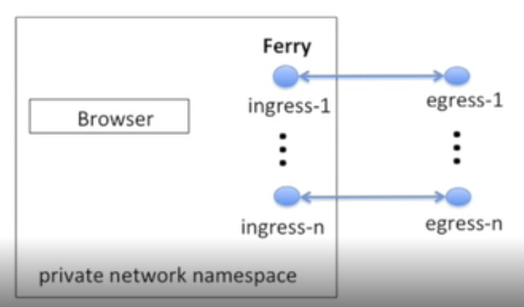
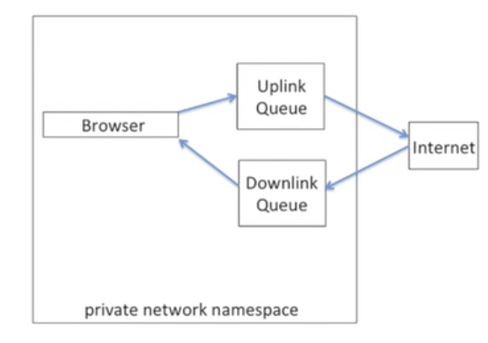
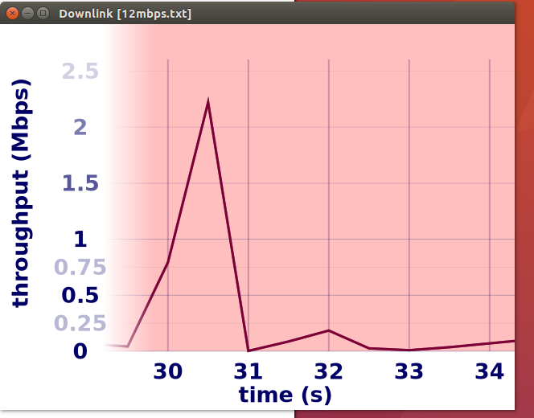

# Mahimahi Documentation
## Useful Links
* [Manual Page](https://manpages.debian.org/stretch/mahimahi/mahimahi.1)
* [Original Project Page](http://mahimahi.mit.edu/) Some of documentation here is based off of the talk linked to on the original Mahimahi project page
* [Traces](https://www.dropbox.com/sh/ss0zs1lc4cklu3u/AAB-8WC3cHD4PTtYT0E4M19Ja?dl=0)

## Purpose and goals
* The purported benefit of mahimahi is to as an accurate record and replay for http
* accuracy -> multi-server emulation
* isolation -> use of private network namespaces
* composability -> structure components as unix shells

## Tools
* all shells can be nested to do diff configs
* Record and Replay
	* RecordShell
	* ReplayShell
* Network Emulation
	* DelayShell
	* LinkShell
	* LossShell

## Workflow
* On Startup
	* private network namespace
	* several ingress and egress interfaces
		* connected via packet ferries
			* record traffic, serve recorded content, delay packets
	* spawns bash shell in the private namespace 
	* {:height="50%" width="50%"}

## ReplayShell
* replay recorded traffic locally
* no egress interfaces, no traffic actually leaves namespace
* makes ingress interface, running seperate apache servers
* benefits
 	* preserves multi-server nature of web app
 	* transparent to client application

## DelayShell/LinkShell
* emulate fixed propagation delay or fixed/variable-rate links
* {:height="50%" width="50%"}
* connect namespace to outer namespace (another mahimahitool or the internet)
* packets spawned in native namespace goes to uplink, packets from other namespace to current namespace in downlink
* DelayShell (min RTT)
** release packets after specified delay
* LinkShell (link rates)
** release based on traces
** live graphing of network usage/queuing delay

## How Goals are achieved
* Accuracy
	* ReplayshellShell correctly emulates multi-server apps
* Isolation
	* Each shell creates new network namespace
	* allows multiple instances to be run in parallel
* Composability
	* each tool structured as a Unix shell
	* unmodified apps can run in each shell
	* shells can be arbitrarily nested within one another

## Replay Example
* Code to run
* The goal here is to record nytimes page, and then emulate a replay with certain delay
* create/copy a .txt file called '12mpbs.txt', like [here](https://github.com/hongzimao/pensieve/blob/master/run_exp/12mbps)
* Commands:
```	
mm-webrecord /tmp/nytimes chromium-browser --ignore-certificate-errors --user-data-dir=/tmp/nonexistent$(date +%s%N) www.nytimes.com
mm-webreplay /tmp/nytimes   
ifconfig
mm-delay 50
ifconfig
mm-link --meter-downlink 12mbps.txt 12mbps.txt
```
* a graphing window should appear, comparing time to throughput (downlink thruput)
```ifconfig``` shows that in different shells, you are in different namespaces, hence different interfaces
* ```mm-webrecord``` records nytimes, and then replay of those files emulates the nytimes recording
* ```mm-replay``` sets up replay environment
* ```mm-delay 50``` sets up rtt 100ms
* WARNING: if you are getting ```std::runtime_error: xcb...``` errors, that means X11 is not working
* Once the ```mm-link``` command starts running, launch nytimes by
```
chromium-browser --incognito http://www.nytimes.com
``` 
* you should now see the below figures, as it attempts to load in the page with 12mbps
* {:height="50%" width="50%"}
* {:height="50%" width="50%"}